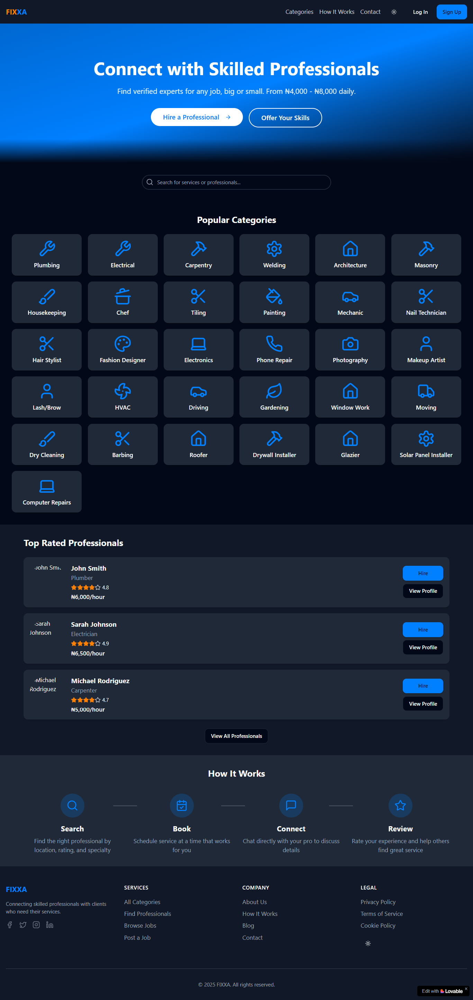

  # FIXXA - Skilled Service Provider Matcher 

**FIXXA** is a location-based web app that connects users with nearby skilled professionals (electricians, plumbers, carpenters, etc.) for fast, reliable, and trackable service delivery.

### 🌍 Live Demo
[Preview the App](https://preview--handy-pro-match.lovable.app/)

### 🚀 Features
- User-friendly interface to request help quickly
- Real-time service provider suggestions
- Location and category filters
- Smooth and intuitive design
- Optimized for mobile responsiveness

### 🧰 Tech Stack
- HTML5
- CSS3
- JavaScript
- [Insert framework or library used, if any]

### 👤 About the Founder
Hi, I'm **Kuyik Bassey** — a designer turned frontend developer and founder of FIXXA. Passionate about using tech to solve real-world problems.

---

### 📌 How to Use
1. Click the demo link.
2. Choose a service category.
3. Match with a nearby professional.
4. Enjoy safe and timely service.

---

### 📬 Contact
For collaborations or inquiries, reach out via [LinkedIn](https://linkedin.com/in/kuyik-bassey) or [Email](mailto:basseykuyik1@gmail.com).
 
